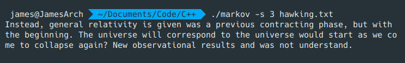
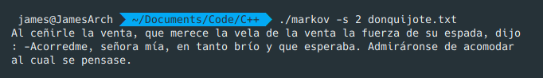

# Markov Chains
A program that tries writing full sentences based on sample texts.

**Description:**

This project uses Markov chains in order to write semi-fluid sentences with interesting results. The sample text is read by the program and a starting word is chosen at random. It then decides which words are likely to follow the previous words and forms as many sentences as the user chooses.

**Examples:**

Text generated from Stephen Hawking's The Origin of the Universe:

Text generated from the first three chapters of Don Quijote de la Mancha:

**Syntax:**

`Usage: markov [-s <sentences>] <files>`